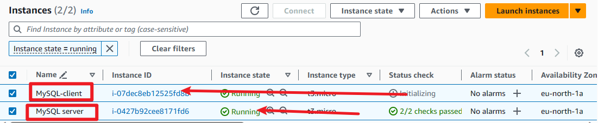
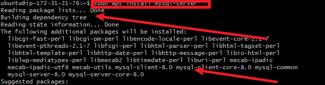
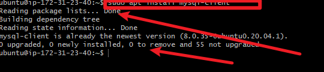
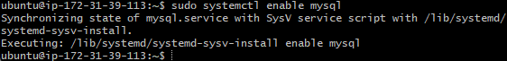
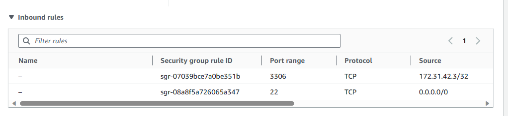
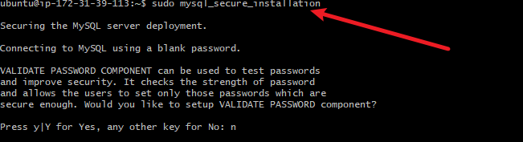
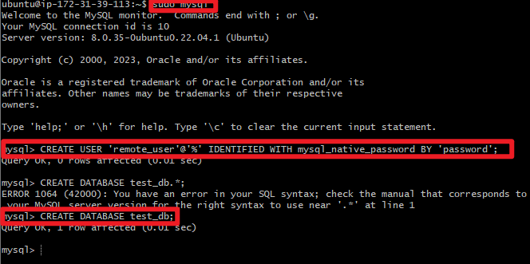
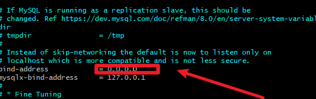
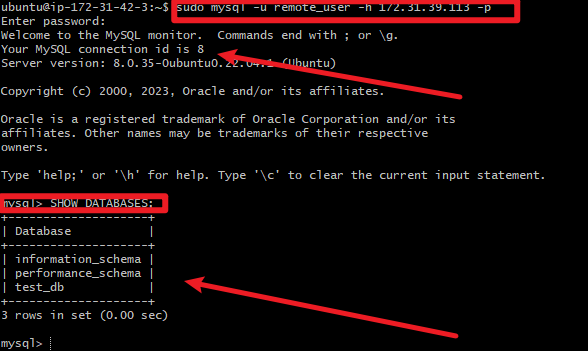

# Understanding Client-Server Architecture

## Client-Server Architecture with MySQL

As you proceed your journey into the world of IT, you will begin to realise that certain concepts apply to many other areas.
One of such concepts is - Client-Server architecture.

Client-Server refers to an architecture in which two or more computers are connected together over a network to send
and receive requests between one another.

In their communication, each machine has its own role: the machine sending requests is usually referred as "Client" and
the machine responding (serving) is called "Server".

In this case, our Web Server has a role of a "Client"that connects and reads/writes to/from a Database (DB) Server
(MySQL, MongoDB, Oracle, SQL Server or any other), and the communication between them happens over a Local
Network (it can also be Internet connection, but it is a common practice to place Web Server and DB Server close to each
other in local network).

The setup on the diagram above is a typical generic Web Stack architecture that you have already implemented in previous
projects (LAMP, LEMP, MEAN, MERN), this architecture can be implemented with many other technologies - various Web
and DB servers, from small Single-page applications SPA to large and complex portals.

## Real example of LAMP website

In Project 1 you implemented a LAMP STACK website, let us take an example of commercially deployed LAMP website -
`www.propitixhomes.com` .

This LAMP website server(s) can be located anywhere in the world and you can reach it also from any part of the globe
over global network - Internet.

Assuming that you go on your browser, and typed in there www.propitixhomes.com . It means that your browser is
considered the "Client". Essentially, it is sending request to the remote server, and in turn, would be expecting some kind of response from the remote server.
Lets take a very quick example and see Client-Server communicatation in action.
Open up your Ubuntu or Windows terminal and run curl command:

`$ curl -Iv www.propitixhomes.com`

Note: If your Ubuntu does not have 'curl', you can install it by running `sudo apt install curl`

# Implement a Client Server Architecture using MySQL

## Database Management System (DBMS).

TASK - Implement a Client Server Architecture using MySQL Database Management System
(DBMS).

To demonstrate a basic client-server using MySQL RDBMS, follow the below instructions

1. Create and configure two Linux-based virtual servers (EC2 instances in AWS).
Server A name - `mysql server`
Server B name - `mysql client`

2. On mysql server Linux Server install MySQL Server software.
Interesting fact: MySQL is an open-source relational database management system. Its name is a combination of "My",
the name of co-founder Michael Widenius's daughter, and "SQL", the abbreviation for Structured Query Language.

3. On mysql client Linux Server install MySQL Client software.

4. By default, both of your EC2 virtual servers are located in the same local virtual network, so they can communicate
to each other using local IP addresses. Use mysql server's local IP address to connect from mysql client .
MySQL server uses TCP port 3306 by default, so you will have to open it by creating a new entry in 'Inbound rules'
in 'mysql server' Security Groups. For extra security, do not allow all IP addresses to reach your 'mysql server' -
allow access only to the specific local IP address of your 'mysql client'.

#Setting Up Secure Installation

#Creating Database and User on MySql
 

5. You might need to configure MySQL server to allow connections from remote hosts.

`sudo vi /etc/mysql/mysql.conf.d/mysqld.cnf`

Replace '127.0.0.1' to '0.0.0.0' like this:

6. From `mysql client` Linux Server connect remotely to `mysql server` Database Engine without using `SSH` . You
must use the mysql utility to perform this action.

7. Check that you have successfully connected to a remote MySQL server and can perform SQL queries

`Show databases;`

If you see an output similar to the below image, then you have successfully completed this project - you have deloyed a
fully functional MySQL Client-Server set up. Well Done! You are getting there gradually. You can further play around with
this set up and practice in creating/dropping databases & tables and inserting/selecting records to and from them.

